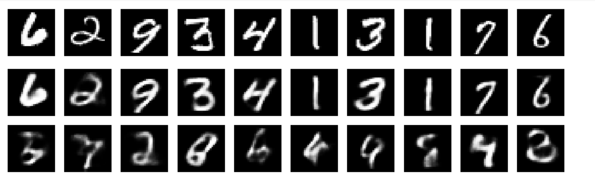

# Variational Autoencoder (VAE) Implementation on the MNIST Dataset

This repository contains my implementation of a Variational Autoencoder (VAE) using the MNIST dataset. VAEs are a type of generative model that combine deep learning with probabilistic modeling to generate new data similar to the input data. This implementation aims to learn and generate handwritten digits similar to those found in the MNIST dataset.

## Table of Contents
- [Introduction](#introduction)
- [Requirements](#requirements)
- [Installation](#installation)
- [Usage](#usage)
- [Model Architecture](#model-architecture)
- [Training](#training)
- [Results](#results)
- [References](#references)

## Introduction
Variational Autoencoders (VAEs) are a powerful type of generative model that incorporate the concepts of deep learning and Bayesian inference. In this project, I trained a VAE on the MNIST dataset, which consists of 28x28 grayscale images of handwritten digits, to learn the underlying distribution and generate similar images.

## Requirements
Ensure you have the following libraries installed:
- Python 3.x
- PyTorch
- torchvision
- numpy
- matplotlib
- jupyter (for running the notebook)

You can install the required packages using pip:
```bash

pip install torch torchvision numpy matplotlib jupyter
```
## Installation
You can clone this repo from 
git clone https://github.com/irungum/VAE-on-MNIST.git
cd VAE-on-MNIST
```bash
jupyter notebook VAE_Implementation_.ipynb
```

## Usage
Open the Jupyter Notebook to explore and run the code:
```bash
jupyter notebook VAE_Implementation_.ipynb
```

## Model Architecture
The VAE model consists of:

-An Encoder: Maps the input images to a latent space with mean and variance components.
-A Latent Space: Represents the distribution from which new data can be sampled.
-A Decoder: Generates images based on the latent representations.

## Training
The model is trained using the MNIST dataset, which contains 60,000 training images and 10,000 test images of handwritten digits. The loss function used is a combination of:

-Reconstruction Loss: Measures how well the generated image matches the original image.
-KL Divergence: Measures the similarity between the learned latent space and the target distribution (assumed to be Gaussian).
-The notebook provides an in-depth explanation of the training process, including code to visualize the generated images after each epoch.

## Results
The trained model successfully generates realistic handwritten digits that closely resemble those in the MNIST dataset.
Below are some of the generated samples from the model:



The top row is the original MNIST data, the middle row is the reconstructed outputs, and the last row is the generated samples

## References
1. Kingma, D.P., & Welling, M. (2013). Auto-Encoding Variational Bayes. arXiv preprint arXiv:1312.6114.
